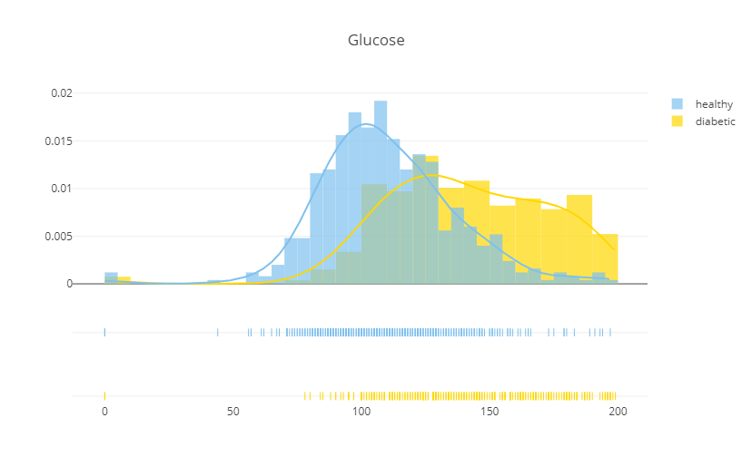
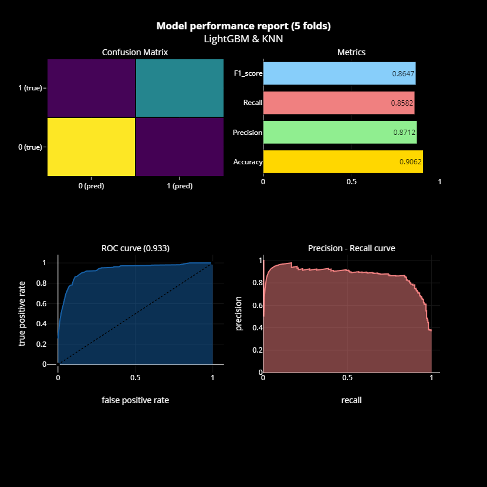

# Proyecto de Predicción de Diabetes en Mujeres🏥

## Recursos🔗
- [Presentación](https://www.canva.com/design/DAGUfZruTUY/ERn-bJsmliQ2zy1d-wo9vg/view?utm_content=DAGUfZruTUY&utm_campaign=designshare&utm_medium=link&utm_source=editor)
- Autor:
  - `Jose Angel Martin Galeote` - [Linkedin](https://www.linkedin.com/in/jose-martin-galeote/)

## Descripción del Proyecto	📄
El objetivo de este proyecto es predecir si un paciente tiene diabetes o no, basándonos en datos médicos. Utilizamos el dataset de Pima Indians disponible en Kaggle, y se aplican técnicas de análisis de datos y machine learning para crear un modelo predictivo con alta precisión.

El modelo principal utilizado en este proyecto es LightGBM, un algoritmo eficiente y rápido basado en el método de boosting.

## Dataset📁
El conjunto de datos utilizado es el famoso Pima Indians Diabetes Database, que contiene datos sobre mujeres de herencia Pima Indian que tienen al menos 21 años. Cada registro contiene 8 características médicas y una columna de salida que indica si el paciente tiene diabetes.

## Contenido del Proyecto📎
Este repositorio contiene los siguientes archivos y carpetas:

- `Diabetes Woman Prediction.ipynb`: El cuaderno Jupyter que contiene todo el análisis, desde la carga de datos hasta la evaluación de los modelos.
- `diabetes.csv`: El conjunto de datos utilizado en el proyecto.
- `requirements.txt`: Lista de librerías necesarias para ejecutar el proyecto.
- `README.md`: Este archivo con la descripción del proyecto.
- `bot_telegram.py`: Archivo de python para crear el chatbot que de momento no funciona.
  
## Columnas del dataset:📉
El dataset utilizado proviene de [esta pagina de Kaggle](https://www.kaggle.com/datasets/akshaydattatraykhare/diabetes-dataset/data) y contiene información médica de pacientes, como:

- **Pregnancies**: Número de embarazos.
- **Glucose**: Concentración de glucosa en sangre.
- **Blood Pressure:**: Presión arterial diastólica.
- **Skin Thickness:**: Grosor del pliegue cutáneo.
- **Insulin:**: Nivel de insulina.
- **BMI:**: Índice de Masa Corporal (IMC).
- **Diabetes Pedigree Function**: Función del historial familiar de diabetes.
- **Age:**: Edad.
- **Outcome:**: 0 o 1 (Indica si el paciente tiene diabetes o no).

## Instalación y Requisitos 📊
Para ejecutar este proyecto, necesitarás las siguientes librerías de Python:

```bash
lightgbm==4.5.0
numpy==1.24.2
pandas==2.1.0
scikit-learn==1.3.0
matplotlib==3.8.0
seaborn==0.12.2
```

Puedes instalar todas las dependencias usando el archivo requirements.txt:
```bash
pip install -r requirements.txt
```

# Estructura del Proyecto📐

## Limpieza de Datos:

- Eliminación de duplicados y valores irrelevantes.
- Filtrado de categorías innecesarias.
- Verificación de valores nulos.
  
## Modelo de Machine Learning:

Se utiliza LightGBM como el modelo principal, debido a su capacidad para manejar grandes conjuntos de datos y su eficiencia en términos de velocidad de entrenamiento y precisión.

## Etapas del proceso de modelado:

- Análisis exploratorio de datos (EDA): Se visualizan las distribuciones de las características y la relación con la variable objetivo.
- Preprocesamiento: Se manejan valores faltantes y se escalan las variables.
- Entrenamiento del modelo: Se entrena el modelo utilizando validación cruzada con LightGBM.
- Optimización de hiperparámetros: Se usa la búsqueda aleatoria (RandomSearch) para optimizar los parámetros de LightGBM.

## Resultados

- El modelo entrenado alcanza una precisión (accuracy) de alrededor del 90%, lo que significa que puede predecir correctamente si un paciente tiene diabetes o no en 9 de cada 10 casos..
- Las variables más importantes para predecir la diabetes fueron los niveles de glucosa en sangre y los embarazos.



## Métricas de evaluación:

- Precisión (Accuracy): 90.6%
- AUC (Area Under the Curve): 0.906
- Matriz de confusión: La matriz de confusión muestra los verdaderos positivos y negativos para evaluar la efectividad del modelo.




## Cómo Ejecutar el Proyecto💻

Clona este repositorio:
```bash
git clone https://github.com/Josemargal/Diabetes-Woman-Prediction
```

Instala las dependencias:
```bash
pip install -r requirements.txt
```

Ejecuta el archivo Diabetes Woman Prediction.ipynb en un entorno de Jupyter Notebook para realizar el análisis completo.

## Próximos Pasos👞👞

- Ampliar el análisis a otros datasets.
- Mejorar la interpretabilidad del modelo.
- Explorar otros algoritmos de machine learning.
- Terminar y mejorar el chatbot sobre diabetes.

## Contribuciones🍻🍻

Las contribuciones son bienvenidas. Si deseas contribuir, por favor abre un issue o crea un pull request explicando las mejoras o problemas que has encontrado.
